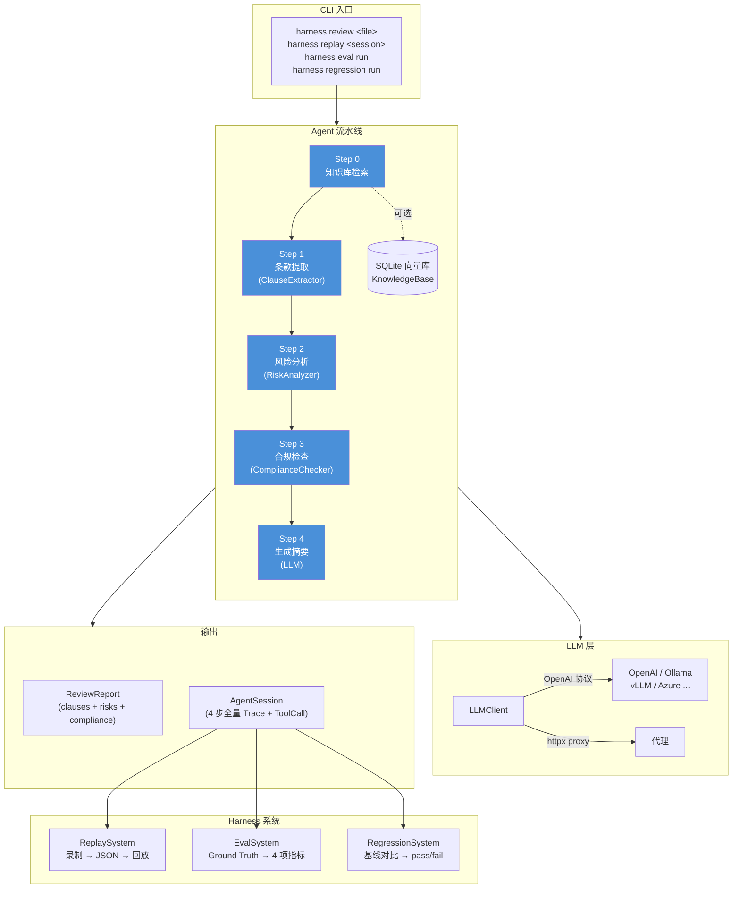

# contract-harness

可回放、可评测、可回归的**法律合同审查 Agent** 系统。

基于自研 Agent Loop 框架，集成了 LLM 编排、工具调用、知识库（RAG）、会话回放、评测评分、回归对比和 Web 界面。

## 安装

### Conda（推荐）

```bash
conda env create -f environment.yml
conda activate contract-harness
pip install -e .
```

### pip

```bash
pip install -e .
```

### 额外依赖

```bash
pip install -e ".[dev]"    # 开发工具（pytest, ruff, pyright）
pip install -e ".[local]"  # 本地 Embedding 模型（sentence-transformers）
```

## 快速使用

### 审查合同

```bash
harness review examples/contracts/sample_nda.json
```

审查流程：条款提取 → 风险分析 → 合规检查 → 生成报告

### 回放审查会话

```bash
harness replay <session_id>
harness sessions          # 列出所有会话
harness replay <id> --json  # JSON 格式输出
```

### 运行评测

```bash
harness eval run examples/contracts/
harness eval report
```

### 回归测试

```bash
harness regression run examples/contracts/
harness regression diff <session_a> <session_b>
```

### Web 界面

```bash
harness serve
```

访问 http://127.0.0.1:8000 查看 Web 界面，支持合同上传审查、会话回放等功能。

### 知识库管理

```bash
harness kb seed                    # 导入内置法律条文（民法典、劳动合同法等 7 部）
harness kb import <file>           # 导入单个文件
harness kb import-dir <directory>  # 批量导入目录下所有文件
harness kb list                    # 列出所有文档
harness kb search <query>          # 检索知识库
```

### 采集法律条文

```bash
harness collect --source seed               # 从内置种子采集
harness collect --source npc --query 民法典  # 从国家法律法规数据库采集
harness collect --source npc --no-import    # 只保存文件，不导入知识库
```

## 架构

```
harness/
├── agent/        合同审查 Agent（LLM 编排 + 工具调用）
├── replay/       回放系统（录制 + 回放 + 存储管理）
├── eval/         评测系统（数据集 + 指标 + 评分流水线）
├── regression/   回归系统（测试套件 + 对比器）
├── rag/          知识库（Embedding + 向量存储 + 检索）
├── web/          FastAPI Web 界面（审查 + 会话）
├── cli/          命令行入口（click + rich）
├── core/         核心类型（pydantic）、配置、异常
└── utils/        工具函数
```

### 流程图



## 知识库（RAG）

系统内置基于 RAG 的知识库，支持导入合同法规文档并在审查时自动检索参考信息。

```bash
# 代码中使用
kb = KnowledgeBase(store, embedding, llm=llm_client)
kb.add_file("path/to/regulation.pdf")
kb.add_text("法规标题", "法规内容...")

# 审查时自动检索并注入上下文
agent = ContractAgent(llm, knowledge_base=kb)
```

- **Embedding**：支持 OpenAI API（默认）和本地 sentence-transformers 模型
- **向量存储**：SQLite 持久化，余弦相似度搜索
- **文档解析**：支持 TXT / JSON / PDF / DOCX 格式
- **分块策略**：AI 智能分块（可选 LLM 驱动）→ 段落级 → 句子级 → 字符回退
- **重排序**：支持 Reranker 精排，在向量检索后对候选结果重新打分排序（OpenAI API / local cross-encoder）
- **种子数据**：内置 7 部常用法律条文（民法典合同编、劳动合同法、数据安全法、个人信息保护法、反垄断法、公司法、商标法），`harness kb seed` 一键导入

## 自定义 LLM 供应商

通过设置 `api_base` 和对应环境变量，可接入任意 OpenAI 兼容接口：

```bash
export DEEPSEEK_API_KEY="sk-xxx"
export DEEPSEEK_API_BASE="https://api.deepseek.com/v1"

# 代码中指定 provider
config = LLMConfig(provider="deepseek", model="deepseek-chat")
```

支持代理：

```bash
export HTTP_PROXY="http://127.0.0.1:7890"
# 或代码中
config = LLMConfig(proxy="http://127.0.0.1:7890")
```

## 环境变量

| 变量 | 说明 | 默认值 |
|---|---|---|
| `OPENAI_API_KEY` | LLM API 密钥（必填） | - |
| `OPENAI_API_BASE` | LLM API 地址 | `https://api.openai.com/v1` |
| `LLM_PROVIDER` | LLM 供应商 | `openai` |
| `LLM_PROXY` | LLM 代理地址 | 同 `HTTP_PROXY` |
| `{PROVIDER}_API_KEY` | 自定义供应商密钥 | 同 `OPENAI_API_KEY` |
| `{PROVIDER}_API_BASE` | 自定义供应商地址 | 同 `OPENAI_API_BASE` |
| `EMBEDDING_PROVIDER` | Embedding 供应商 | `openai` |
| `EMBEDDING_API_KEY` | Embedding API 密钥 | 同 `OPENAI_API_KEY` |
| `EMBEDDING_API_BASE` | Embedding API 地址 | 同 `OPENAI_API_BASE` |
| `EMBEDDING_PROXY` | Embedding 代理地址 | 同 `HTTP_PROXY` |
| `RERANK_PROVIDER` | Reranker 供应商（openai / local） | 无 |
| `RERANK_API_KEY` | Reranker API 密钥 | 同 `OPENAI_API_KEY` |
| `RERANK_API_BASE` | Reranker API 地址 | 同 `OPENAI_API_BASE` |
| `RERANK_MODEL` | Reranker 模型 | `rerank-v1` |
| `HTTP_PROXY` | 通用代理（回退） | - |
| `HARNESS_DATA_DIR` | 数据根目录（知识库、回放等） | 项目下 `.harness/` |

## 开发

```bash
conda activate contract-harness
pip install -e ".[dev]"
pytest tests/ -v             # 运行 34 个单元测试
ruff check harness/ tests/   # 代码检查
ruff format --check harness/ tests/  # 格式检查
pyright harness/             # 类型检查
```
