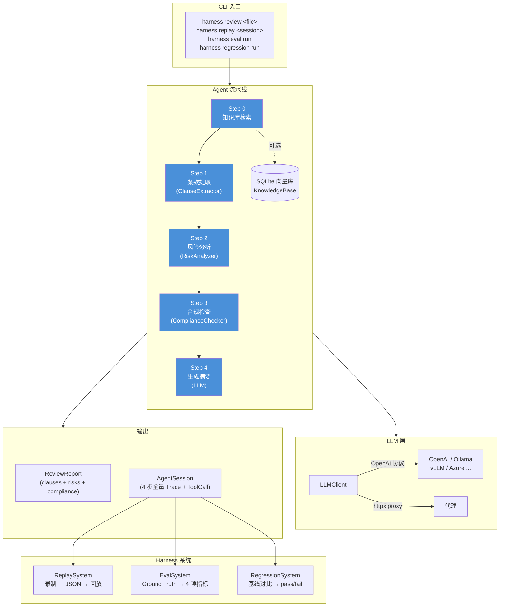

# contract-harness

可回放、可评测、可回归的**法律合同审查 Agent** 系统。

基于自研 Agent Loop 框架，集成了 LLM 编排、工具调用、会话回放、评测评分和回归对比能力。

## 安装

### Conda（推荐）

```bash
conda env create -f environment.yml
conda activate contract-harness
pip install -e .
```

### pip

```bash
pip install -e .
```

## 快速使用

### 审查合同

```bash
harness review examples/contracts/sample_nda.json
```

审查流程：条款提取 → 风险分析 → 合规检查 → 生成报告

### 回放审查会话

```bash
harness replay <session_id>
harness sessions          # 列出所有会话
harness replay <id> --json  # JSON 格式输出
```

### 运行评测

```bash
harness eval run examples/contracts/
harness eval report
```

### 回归测试

```bash
harness regression run examples/contracts/
harness regression diff <session_a> <session_b>
```

### Web 界面

```bash
harness serve
```

访问 http://127.0.0.1:8000 查看 Web 界面，支持合同上传审查、会话回放等功能。

## 架构

```
harness/
├── agent/        合同审查 Agent（LLM 编排 + 工具调用）
├── replay/       回放系统（录制 + 回放 + 存储管理）
├── eval/         评测系统（数据集 + 指标 + 评分流水线）
├── regression/   回归系统（测试套件 + 对比器）
├── rag/          知识库（Embedding + 向量存储 + 检索）
├── cli/          命令行入口（click + rich）
├── core/         核心类型（pydantic）、配置、异常
└── utils/        工具函数
```

### 流程图



## 环境变量

| 变量 | 说明 | 默认值 |
|---|---|---|
| `OPENAI_API_KEY` | OpenAI API 密钥（必填） | - |

## 开发

```bash
conda activate contract-harness
pip install -e ".[dev]"
pytest tests/ -v             # 运行测试
ruff check harness/ tests/   # 代码检查
```
