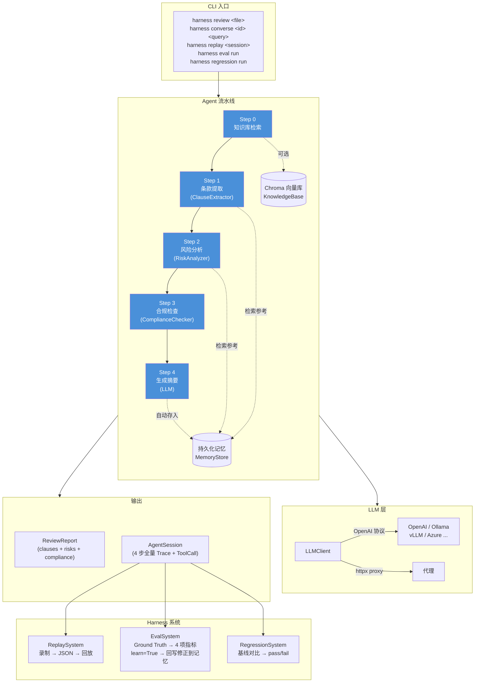

# contract-harness

可回放、可评测、可回归的**法律合同审查 Agent** 系统。

基于自研 Agent Loop 框架，集成了 LLM 编排、工具调用、知识库（RAG）、会话回放、评测评分、回归对比和 Web 界面。

## 安装

### Conda（推荐）

```bash
conda env create -f environment.yml
conda activate contract-harness
pip install -e .
```

### pip

```bash
pip install -e .
```

### 额外依赖

```bash
pip install -e ".[dev]"    # 开发工具（pytest, ruff, pyright）
pip install -e ".[local]"  # 本地 Embedding 模型（sentence-transformers）
```

## 快速使用

### 审查合同

```bash
harness review examples/contracts/sample_nda.json
```

支持 4 种 Agent 模式（通过 `--mode` 或 `HARNESS_AGENT_MODE` 配置）：

| 模式 | 说明 |
|---|---|
| `pipeline`（默认） | 固定步骤串行：条款提取 → 风险分析 → 合规检查 → 生成报告 |
| `react` | ReAct 循环，LLM 自主决策工具调用顺序 |
| `reflection` | Pipeline 审查后追加自审修正，提升报告质量 |
| `multi_agent` | Supervisor + 3 个专业子 Agent 协同审查 + 交叉验证 |

### 继续对话（追问）

```bash
harness converse <session_id> "这个保密条款风险高吗？"
```

多轮追问，Agent 基于上次审查报告上下文回答。

### 回放审查会话

```bash
harness replay <session_id>
harness sessions          # 列出所有会话
harness replay <id> --json  # JSON 格式输出
```

### 运行评测

```bash
harness eval run examples/contracts/
harness eval report
```

### 回归测试

```bash
harness regression run examples/contracts/
harness regression diff <session_a> <session_b>
```

### Web 界面

```bash
harness serve
```

访问 http://127.0.0.1:8000 查看 Web 界面，支持合同上传审查、会话回放等功能。

### 知识库管理

```bash
harness kb seed                    # 导入内置法律条文（民法典、劳动合同法等 7 部）
harness kb import-file <file>      # 导入单个文件（支持 txt/md/json/pdf/docx/zip）；--docling 启用结构解析；--work-dir 指定临时目录（Windows C 盘空间不足时）
harness kb import-dir <directory>  # 批量导入；--docling 启用结构解析；--work-dir 指定临时目录
harness kb list-docs               # 列出所有文档
harness kb search <query>          # 检索知识库
harness kb eval generate           # 从 KB 自动生成评估数据集（LLM 从每个 chunk 生成 query）
harness kb eval run <dataset>      # 执行 RAG 检索质量评估（HitRate/MRR/Precision/Recall）
```

## 架构

```
harness/
├── agent/        合同审查 Agent（LLM 编排 + 工具调用 + 记忆）
│   ├── multi_agent/     多 Agent 协同（Worker/Supervisor/CrossValidator）
│   └── memory.py         持久化记忆 + 自演进（ChromaDB）
├── replay/       回放系统（录制 + 回放 + 存储管理）
├── eval/         评测系统（数据集 + 指标 + 评分流水线）
├── eval_rag/     RAG 检索质量评估（数据模型 + 指标 + 生成 + 执行 + 报告）
├── regression/   回归系统（测试套件 + 对比器）
├── rag/          知识库（Embedding + 向量存储 + 检索 + 稀疏检索 + Reranker）
├── web/          FastAPI Web 界面（审查 + 会话 + 追问）
├── cli/          命令行入口（click + rich）
├── core/         核心类型（pydantic）、配置、异常
└── utils/        工具函数（含 load_dotenv、文件读写等）
```

### 流程图



## 知识库（RAG）

系统内置基于 RAG 的知识库，支持导入合同法规文档并在审查时自动检索参考信息。

```bash
# 代码中使用
kb = KnowledgeBase(store, embedding, llm=llm_client)
kb.add_file("path/to/regulation.pdf")
kb.add_text("法规标题", "法规内容...")

# 审查时自动检索并注入上下文
agent = ContractAgent(llm, knowledge_base=kb)
```

- **Embedding**：支持 OpenAI API（默认）和本地 sentence-transformers 模型
- **向量存储**：Chroma 持久化，HNSW ANN 近似搜索
- **文档解析**：支持 TXT / JSON / PDF / DOCX / ZIP（自动解压提取）格式；可选 Docling 引擎（PDF/DOCX/PPTX/图片 → 结构化 Markdown）
- **Embedding 速率限制**：支持 `EMBEDDING_MAX_RPM` / `EMBEDDING_MAX_TPM` 配置，滑动窗口自动限速，避免 API 429
- **分块策略**：AI 智能分块（可选 LLM 驱动）→ 逐条法律分块 → 段落级 → 句子级 → 字符回退
- **检索策略**：默认稠密向量 ANN 检索；可启用**混合检索**（稠密 + BM25 稀疏 + RRF 融合），提升法律术语精确匹配
- **重排序**：支持 Reranker 精排，在向量检索后对候选结果重新打分排序（OpenAI API / local cross-encoder）
- **种子数据**：内置 7 部常用法律条文（民法典合同编、劳动合同法、数据安全法、个人信息保护法、反垄断法、公司法、商标法），`harness kb seed` 一键导入

## 持久化记忆与自演进

系统内置基于 ChromaDB 的持久化记忆机制：

1. **自动记忆** — 每次审查完成后，条款级分析结果（风险等级、合规状态）自动存入记忆库
2. **参考回溯** — 新审查时自动检索相似历史案例，注入 LLM Prompt 作为参考
3. **修正信号** — 评测时设置 `learn=True`，将期望结果与 Agent 输出的差异作为修正信号存入记忆；下次遇到同类条款时，修正结果自动优先展示

```bash
# Python 中使用
from harness.agent.memory import MemoryStore
from harness.core.config import HarnessConfig

config = HarnessConfig()
store = MemoryStore(config.memory_dir)
store.remember_session(clauses, risks, compliance, session_id)
memories = store.recall("保密条款内容", top_k=3)
store.correct("违约", "违约金条款", "risk_level", "high")
```

## 继续对话（追问）

审查完成后可通过 `session_id` 继续追问：

```bash
# CLI
harness converse a1b2c3 "为什么这个条款判为高风险？"

# Web
POST /sessions/{id}/converse
```

Agent 会加载历史审查报告重建上下文，回答追问，并将对话历史持久化到 session 文件中，支持多轮连续追问。

## Docling 文档解析（可选）

处理 PDF / DOCX / PPTX / 图片等复杂格式文件时，可用 Docling 替代 pypdf/python-docx 获得结构化 Markdown 输出（保留标题层级、表格、列表）：

```bash
pip install "contract-harness[docling]"
```

```python
from harness.core.config import HarnessConfig
from harness.rag.knowledge_base import KnowledgeBase

config = HarnessConfig()
config.use_docling = True
kb = KnowledgeBase.from_config(config)
```

Docling 不可用时自动静默回退到原有解析器，不影响已有功能。

## 自定义 LLM 供应商

通过设置 `api_base` 和对应环境变量，可接入任意 OpenAI 兼容接口：

```bash
export DEEPSEEK_API_KEY="sk-xxx"
export DEEPSEEK_API_BASE="https://api.deepseek.com/v1"

# 代码中指定 provider
config = LLMConfig(provider="deepseek", model="deepseek-chat")
```

支持代理：

```bash
export HTTP_PROXY="http://127.0.0.1:7890"
# 或代码中
config = LLMConfig(proxy="http://127.0.0.1:7890")
```

## 环境变量

项目启动时自动从项目根目录向上加载 `.env` 文件（`harness/utils/io.py:load_dotenv`）。参考 `.env.example` 创建配置。

| 变量 | 说明 | 默认值 |
|---|---|---|
| `OPENAI_API_KEY` | LLM API 密钥（必填） | - |
| `OPENAI_API_BASE` | LLM API 地址 | `https://api.openai.com/v1` |
| `LLM_PROVIDER` | LLM 供应商 | `openai` |
| `LLM_MOCK` | 启用 mock LLM 响应（`1`/`true`/`yes`），CI 无 secret 时跑通回归测试 | - |
| `LLM_PROXY` | LLM 代理地址 | 同 `HTTP_PROXY` |
| `CHUNK_MODEL` | AI 分块模型 | `gpt-4o-mini` |
| `CHUNK_API_KEY` | AI 分块 API 密钥 | 同 `OPENAI_API_KEY` |
| `CHUNK_API_BASE` | AI 分块 API 地址 | 同 `OPENAI_API_BASE` |
| `{PROVIDER}_API_KEY` | 自定义供应商密钥 | 同 `OPENAI_API_KEY` |
| `{PROVIDER}_API_BASE` | 自定义供应商地址 | 同 `OPENAI_API_BASE` |
| `EMBEDDING_PROVIDER` | Embedding 供应商 | `openai` |
| `EMBEDDING_API_KEY` | Embedding API 密钥 | 同 `OPENAI_API_KEY` |
| `EMBEDDING_API_BASE` | Embedding API 地址 | 同 `OPENAI_API_BASE` |
| `EMBEDDING_MODEL` | Embedding 模型 | `text-embedding-3-small` |
| `EMBEDDING_PROXY` | Embedding 代理地址 | 同 `HTTP_PROXY` |
| `RERANK_PROVIDER` | Reranker 供应商（openai / local） | 无 |
| `RERANK_API_KEY` | Reranker API 密钥 | 同 `OPENAI_API_KEY` |
| `RERANK_API_BASE` | Reranker API 地址 | 同 `OPENAI_API_BASE` |
| `RERANK_MODEL` | Reranker 模型 | `rerank-v1` |
| `ENABLE_HYBRID_SEARCH` | 启用混合检索（稠密+BM25+RRF） | `false` |
| `EMBEDDING_MAX_RPM` | Embedding API 每分钟最大请求数（0=不限） | `0` |
| `EMBEDDING_MAX_TPM` | Embedding API 每分钟最大 Token 数（0=不限） | `0` |
| `VECTOR_STORE_BACKEND` | 向量存储后端（已废弃，仅支持 chroma） | `chroma` |
| `HTTP_PROXY` | 通用代理（回退） | - |
| `HARNESS_DATA_DIR` | 数据根目录（知识库、回放、记忆等） | 项目下 `.harness/` |

## CLI 架构（Click 用法）

所有 CLI 命令定义在 `harness/cli/main.py`，使用 Click 库构建。本项目遵循以下 Click 模式：

### 根命令组

```python
@click.group()
@click.option("--verbose", "-v", is_flag=True, help="启用详细输出")
@click.pass_context
def cli(ctx: click.Context, verbose: bool) -> None:
    """合同审查 Agent 系统 CLI。"""
    ctx.ensure_object(dict)
    config = HarnessConfig()
    ctx.obj["config"] = config
```

- `@click.group()` 定义根命令组，所有子命令挂载在其上
- `@click.option` 定义全局选项（如 `--verbose`），所有子命令共享
- **⚠️ 组级别选项必须放在子命令之前**：`harness --verbose review` ✅ / `harness review --verbose` ❌
- `@click.pass_context` 注入 `click.Context`，通过 `ctx.obj` 字典在命令间传递共享对象（如 `HarnessConfig`）

### 子命令（平级）

```python
@cli.command()
@click.argument("contract_file", type=click.Path(exists=True))
@click.option("--save/--no-save", default=True, help="是否保存回放记录")
@click.pass_context
def review(ctx: click.Context, contract_file: str, save: bool) -> None:
    """审查一份合同并展示结果。"""
    config: HarnessConfig = ctx.obj["config"]
```

- `@cli.command()` 将函数注册为根命令组的平级子命令（如 `harness review`)
- `@click.argument` 定义位置参数，`type=click.Path(exists=True)` 自动校验文件存在
- `--save/--no-save` 是布尔 flag 的惯用写法，Click 自动生成 `--save` 和 `--no-save` 两个选项

### 命令组嵌套

```python
@cli.group()
def kb() -> None:
    """知识库管理命令组。"""

@kb.command()
@click.argument("query")
@click.option("--top-k", default=5, help="返回结果数")
@click.pass_context
def search(ctx: click.Context, query: str, top_k: int) -> None:
    """检索知识库。"""
```

- `@cli.group()` 定义嵌套命令组（如 `harness kb`）
- 子组内的命令通过 `@组名.command()` 注册（如 `harness kb search`）

### context 传递模式

`ctx.obj` 是 Click 推荐的跨命令数据传递方式。本项目统一使用 `ctx.obj["config"]` 传递 `HarnessConfig`，确保所有命令共享同一配置实例。

### 关键装饰器速查

| 装饰器 | 用途 |
|---|---|
| `@click.group()` | 定义命令组（可嵌套） |
| `@click.command()` | 定义叶命令 |
| `@click.argument()` | 位置参数 |
| `@click.option()` | 命名选项 |
| `@click.pass_context` | 注入 `click.Context` |
| `@click.Path(exists=True)` | 路径类型校验 |

## 开发

```bash
conda activate contract-harness
pip install -e ".[dev]"
pytest tests/ -v             # 运行 179 个单元测试
ruff check harness/ tests/   # 代码检查
ruff format --check harness/ tests/  # 格式检查
pyright harness/             # 类型检查
```
